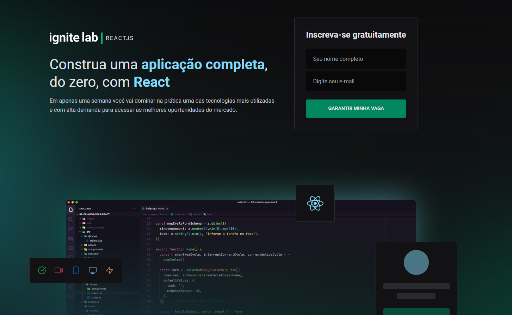
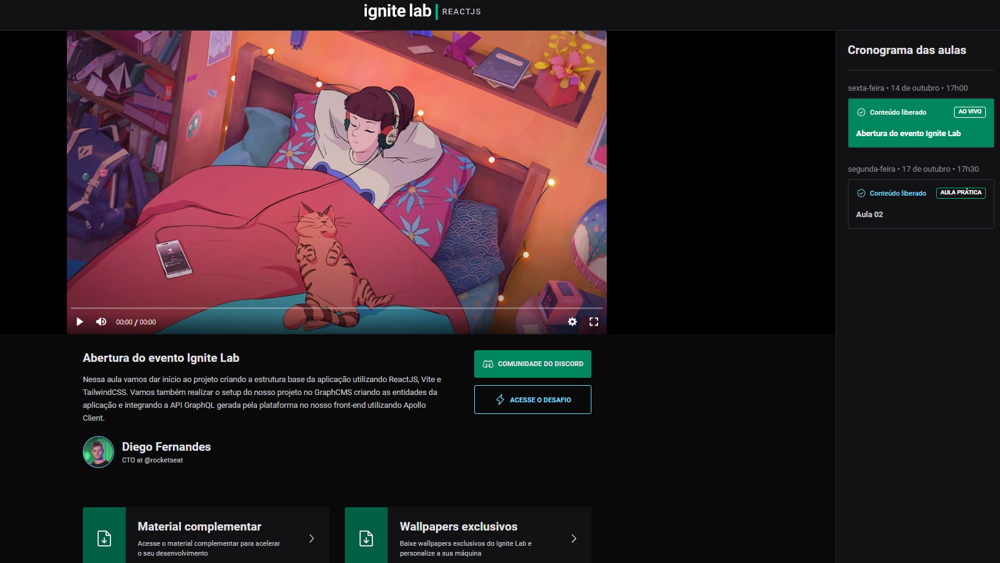

# Ignite Platform

 <br/> <br/>
 <br/> <br/>

## Funcionalidades da aplicação
- Plataforma para visualizar e transitar entre as aulas cadastradas

## Tecnologias utilizadas
- React
- TypeScript
- Vite
- GraphQL
- GraphCMS
- Tailwind
- Date-fns
- Phosphor-react

### Instalação
1. Clone o repositório:

```bash
git clone https://github.com/jlefilho/ignite-platform.git
```

2. Acesse a pasta do projeto:

```bash
cd ignite-platform
```

3. Instale as dependências necessárias:

```bash
npm install
```

4. Execute o projeto:

```bash
npm run dev
```

Ou acesse:

```bash
https://ignite-platform-jlefilho.vercel.app/
```